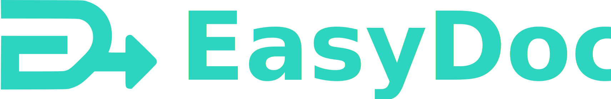

<p align="left">
  
</p>

# EasyDock - Python module to automate molecular docking

EasyDock automates the entire docking process from molecule preparation to result analysis, supporting multiple docking programs and providing organized result storage.

### Key Features

- **Multiple Docking Programs**: Support for Vina, Gnina/Smina, QVina, Vina-GPU and their derivatives
- **Server-Based Docking**: Containerized docking programs (CarsiDock, SurfDock, Vina-GPU) via a persistent server protocol
- **Generic Docking**: Run external docking binary or Python script via a YAML config file, without code changes
- **Automated Preparation**: Molecule validation, salt removal, and stereoisomer enumeration
- **Flexible Protonation**: Multiple methods including MolGpKa, Uni-pKa, Chemaxon, and pkasolver
- **Container Support**: Run docking and protonation tools through Apptainer/Singularity or Docker with automatic GPU detection
- **Distributed Computing**: Scale across multiple servers using Dask
- **Database Storage**: All results organized in SQLite databases
- **Pose Quality Assessment**: PoseBusters integration (`easydock_bust`) for physics-based validation of docked poses
- **PLIF Analysis**: Protein-ligand interaction fingerprints (`easydock_plif`) for detailed analysis
- **Resumable Calculations**: Interrupted runs can be continued seamlessly

### Quick Start

```bash
# Create environment
conda env create -f env.yml -n easydock
# or use mamba (should be faster) 
mamba env create -f env.yml -n easydock

# Run docking
easydock -i input.smi -o output.db --program vina --config config.yml --protonation molgpka -c 4 --sdf
```

## Documentation

<https://easydock.readthedocs.io/en/latest/>

## Licence
BSD-3

## Third-party tools

EasyDock integrates several external tools, each governed by its own license.
See the [full license list](https://easydock.readthedocs.io/en/latest/licenses/) in the documentation.

- Most docking programs and protonation tools are **Apache 2.0** or **MIT**
- Chemaxon requires a **commercial license**
- Meeko is **LGPL-2.1**

## Citation
1. EasyDock: customizable and scalable docking tool.  
Minibaeva, G.; Ivanova, A.; Polishchuk, P.  
*Journal of Cheminformatics* **2023**, 15 (1), 102.  
https://doi.org/10.1186/s13321-023-00772-2
  
  
2. EasyDock 1.3: An Automated Pipeline for Molecular Docking.   
Minibaeva, G.; Yap, V.; Polishchuk, P.  
*J. Chem. Inf. Model.* **2026**.  
https://doi.org/10.1021/acs.jcim.6c01221
