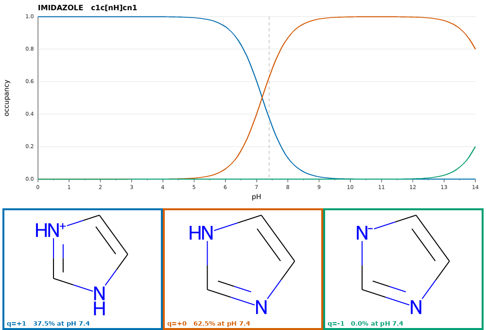

# Usage Guide

There are two major stages which can run separately or simultaneously: ligand preparation and their docking.

## Database Initialization / Ligand Preparation

EasyDock uses an SQLite database to store all inputs, parameters, and results. Once initialized, the database preserves all settings for reproducibility.

!!! info "Database Immutability"
    Once a database is created, most parameters cannot be changed via command line. The database is never overwritten. Delete and reinitialize if settings are incorrect. Direct changes of settings in the database (`setup` table) should be done carefully to not create inconsistent settings.

### Basic Initialization

Create a database with molecule validation:

```bash
easydock -i input.smi -o output.db -c 4
```

Parameters:  
- `-i`: Input SMILES file  
- `-o`: Output database file  
- `-c`: Number of CPU cores  

This performs:  
- Salt removal  
- Generation of one stereoisomer if there are some undefined chiral centers or double bonds (reproducible generation)  
- Conversion to 3D structures (or uses existing coordinates if 3D SDF input)  

### Stereoisomer Enumeration

Enumerate up to 4 stereoisomers for undefined chiral centers and double bonds:

```bash
easydock -i input.smi -o output.db -c 4 -s 4
```

Maximum runtime of stereoisomer enumeration is limited to 300 seconds per molecule. This avoids excessively long generation for some structures. In those cases it is recommended to enumerate stereoisomers before supplying these molecules to EasyDock.

### Protonation Options

Using MolGpKa:
```bash
easydock -i input.smi -o output.db -c 4 --protonation molgpka
```

Using MolGpKa with post-processing SMARTS fixes (corrects common mis-protonations):
```bash
easydock -i input.smi -o output.db -c 4 --protonation molgpka_fix
```

Using pre-built Uni-pKa container:
```bash
easydock -i input.smi -o output.db -c 4 --protonation /path/to/unipka.sif
```

Using Chemaxon (requires license):
```bash
easydock -i input.smi -o output.db -c 4 --protonation chemaxon
```

Custom pH
```bash
easydock -i input.smi -o output.db -c 4 --protonation molgpka --pH 12
```

No protonation (use input states):
```bash
easydock -i input.smi -o output.db -c 4
```

### Standalone Uni-pKa Usage

The Uni-pKa container can also be run on its own, outside the docking pipeline, to inspect
protonation states in more detail than EasyDock needs. Its `protonate` command reads
tab-separated `SMILES<TAB>name` records from a file (`-i`) or from STDIN, and writes the result
to a file (`-o`) or to STDOUT:

```bash
# Apptainer
apptainer run unipka.sif protonate -i input.smi -o output.smi

# Docker
docker run -i unipka protonate -i input.smi -o output.smi
```

Every output line contains the protonated SMILES, the molecule name and the occupancy of that
form at the requested pH:

```
CC(=O)Oc1ccccc1C(=O)[O-]	ASPIRIN	0.9998
```

If no protonation form could be predicted, the input SMILES is returned with `NA` instead of an
occupancy value.

#### Retrieving Several Microspecies

| Argument | Default | Description |
|---|---|---|
| `-n`, `--nforms` | 1 | maximum number of protonation forms per molecule |
| `--occupancy` | 0 | minimum occupancy of a returned form, a fraction in [0, 1] |

The occupancy threshold has a higher priority than the number of forms: the threshold filters the
forms and `-n` only caps how many of them are returned. Therefore fewer than `-n` forms are
returned if not enough of them reach the threshold. If no form reaches it at all, the most
populated one is returned anyway and a warning is logged, so a molecule is never lost.

```bash
# up to 3 forms per molecule, each populated by at least 5%
apptainer run unipka.sif protonate -i input.smi -o output.smi -n 3 --occupancy 0.05
```

All forms of a molecule are written consecutively and ordered by decreasing occupancy
(imidazole at pH 7.4):

```
c1c[nH]cn1	IMIDAZOLE	0.6254
c1c[nH+]c[nH]1	IMIDAZOLE	0.3746
```

!!! note "EasyDock always retrieves a single form"
    EasyDock invokes the container without these arguments and thus receives exactly one line per
    molecule, as before. Several forms of the same molecule cannot be stored in an EasyDock
    database, because a molecule is identified there by `id` and `stereo_id` only.

#### Distribution of Microspecies over pH

`--distribution-file` additionally stores the occupancy of every individual microspecies over a
range of pH values. Free energies of microspecies do not depend on pH, only their reweighting
does, therefore a whole pH range is calculated without additional model predictions.

| Argument | Default | Description |
|---|---|---|
| `--distribution-file` | - | output file for the distribution of microspecies (tab-separated) |
| `--ph-range MIN MAX` | 0 14 | pH range to calculate the distribution |
| `--ph-step` | 0.5 | pH step |
| `--distribution-min-occupancy` | 0.01 | occupancy threshold to store a microspecies |

`--ph-range` and `--ph-step` are used only if `--distribution-file` was supplied.
`--distribution-min-occupancy` applies both to the distribution file and to the images
described below.

```bash
apptainer run unipka.sif protonate -i input.smi -o output.smi \
    --distribution-file distribution.tsv --ph-range 2 12 --ph-step 0.25
```

The file has a header and six columns:

| Column | Description |
|---|---|
| `name` | molecule name |
| `input_smi` | SMILES as it was supplied in the input |
| `microstate_smi` | SMILES of the microspecies |
| `dG` | predicted free energy of the microspecies, does not depend on pH |
| `occupancy` | occupancy of the microspecies at the given pH value |
| `pH` | pH value |

Rows are written in blocks, one block per molecule, and molecules appear in the order they are
completed by the pipeline. Within a block rows are ordered by pH value and then by decreasing
occupancy, thus the most populated microspecies of every pH value comes first and the order
reflects how the ranking changes with pH:

```
name	input_smi	microstate_smi	dG	occupancy	pH
IMIDAZOLE	c1c[nH]cn1	c1c[nH+]c[nH]1	-6.7938	0.999993	2
IMIDAZOLE	c1c[nH]cn1	c1c[nH]cn1	-5.24537	6.64703e-06	2
...
IMIDAZOLE	c1c[nH]cn1	c1c[nH+]c[nH]1	-6.7938	0.600706	7
IMIDAZOLE	c1c[nH]cn1	c1c[nH]cn1	-5.24537	0.399294	7
IMIDAZOLE	c1c[nH]cn1	c1c[nH]cn1	-5.24537	0.625422	7.4
IMIDAZOLE	c1c[nH]cn1	c1c[nH+]c[nH]1	-6.7938	0.374578	7.4
```

A microspecies is stored only if its occupancy reaches `--distribution-min-occupancy` at least at
one pH value of the range. This is decided per microspecies and not per row, so that the whole
curve of a stored microspecies is written and can be plotted without gaps. Consequently every pH
value of a block has the same number of rows. The pH value given by `--pH` is always added to the
range, therefore the occupancies reported in the main output can always be found in the
distribution file.

Molecules for which nothing could be predicted are skipped in the distribution file. They are
reported in the main output and in the log as described above.

#### Plotting the Distribution

`--png` writes one image per molecule into a directory. The upper panel contains occupancy curves
of individual microspecies and the lower panel their 2D structures. Every microspecies has its own
colour which is used for its curve, for the frame of its structure and for its caption, thus the
colour links a curve to a structure.

| Argument | Default | Description |
|---|---|---|
| `--png` | - | output directory for images, created if it does not exist |

```bash
# images only
apptainer run unipka.sif protonate -i input.smi -o output.smi --png images

# both outputs at once
apptainer run unipka.sif protonate -i input.smi -o output.smi \
    --png images --distribution-file distribution.tsv --ph-range 2 12
```



Images are always plotted for the **whole pH range 0-14** with a step of 0.1 to get smooth curves.
`--ph-range` and `--ph-step` apply to the distribution file only and never affect images, whereas
`--distribution-min-occupancy` applies to both outputs. Since the inclusion criterion is applied to
the pH range of each output separately, an image and the distribution file may contain different
sets of microspecies when their ranges differ. For instance, with `--ph-range 8 12` the neutral
form of aspirin is absent from the distribution file because it is not populated above pH 8, but it
is still plotted because it dominates below pH 4.

The dashed vertical line marks the pH value of `--pH`, and the caption of every structure reports
its charge and its occupancy at that pH, which is the value reported in the main output. Images are
1000 px wide, a structure occupies a cell of 330x250 px and up to three cells are placed in a row.
An image is written for every molecule with a predicted ensemble, including molecules having a
single form. Molecules for which nothing could be predicted are skipped, as in the distribution
file.

!!! note "Throughput"
    Rendering takes about 0.1 s per molecule, therefore `--png` is intended for tens or hundreds
    of molecules rather than for whole libraries.

## Molecular Docking

### Vina Docking

Complete pipeline (initialization + docking):
```bash
easydock -i input.smi -o output.db --program vina --config config.yml -c 4 --sdf
```

Using pre-initialized database:
```bash
easydock -o output.db --program vina --config config.yml -c 4 --sdf
```

Vina Configuration (config.yml):
```yaml
protein: /path/to/protein.pdbqt
protein_setup: /path/to/grid.txt
exhaustiveness: 8
seed: 0
n_poses: 5
ncpu: 5
```

Grid Box Definition (grid.txt):
```
center_x = 10.0
center_y = 15.0
center_z = 20.0
size_x = 25.0
size_y = 25.0
size_z = 25.0
```

!!! note "CPU Parameters"
    - Command line `-c 4`: Docks 4 molecules in parallel
    - Config `ncpu: 5`: Uses 5 CPUs per molecule
    - Total CPUs: 4 × 5 = 20
    
    Ensure the product matches or slightly exceeds available CPUs.

### Gnina Docking

```bash
easydock -i input.smi -o output.db --program gnina --config config.yml -c 4 --sdf
```

Gnina Configuration:
```yaml
script_file: /path/to/gnina
protein: /path/to/protein.pdbqt
protein_setup: /path/to/grid.txt
exhaustiveness: 8
scoring: default
cnn_scoring: rescore
cnn: dense_ensemble
n_poses: 10
addH: False
ncpu: 1
seed: 0
```

### Smina Docking

Use Gnina program with Smina-specific configuration:

```yaml
script_file: /path/to/gnina
protein: /path/to/protein.pdbqt
protein_setup: /path/to/grid.txt
exhaustiveness: 8
scoring: vinardo
cnn_scoring: None
cnn: dense_ensemble
n_poses: 10
addH: False
ncpu: 1
seed: 0
```

### Vina-GPU Family

For Vina-GPU, QVina2-GPU, or QVinaW-GPU:

```bash
easydock -i input.smi -o output.db --program vina-gpu --config config.yml --sdf
```

Configuration:
```yaml
script_file: /path/to/AutoDock-Vina-GPU-2-1 --opencl_binary_path /path/to/opencl/
protein: /path/to/protein.pdbqt
protein_setup: /path/to/grid.txt
n_poses: 3
thread: 8000  # Optional, default is 8000
```

!!! tip "Program Variants"
    Change `script_file` to use different variants:
    
    - `AutoDock-Vina-GPU-2-1` for Vina-GPU
    - `QuickVina2-GPU-2-1` for QVina2-GPU
    - `QuickVina-W-GPU-2-1` for QVinaW-GPU

### QVina2 / QVina-W

```bash
easydock -i input.smi -o output.db --program qvina --config config.yml --sdf
```

Configuration:
```yaml
script_file: /path/to/qvina2  # or /path/to/qvinaw
protein: /path/to/protein.pdbqt
protein_setup: /path/to/grid.txt
exhaustiveness: 8
n_poses: 3
ncpu: 2
seed: 0
```

!!! tip "Program Variants"
    Change `script_file` to use different variants:
    
    - `qvina2`
    - `qvina-w`
    
    The `qvina` module also accepts a plain `vina` binary — the CLI is compatible.

### Server-Based Docking

`--program server` enables docking through a long-running server process. The server is started once per worker and handles multiple molecules without restarting. This mode supports containerized docking programs such as CarsiDock and GPU-accelerated Vina variants.

```bash
easydock -i input.smi -o output.db --program server --config config.yml -c 4 --sdf
```

!!! tip "GPU Auto-Detection"
    If `nvidia-smi` is accessible, EasyDock automatically adds `--nv` (Apptainer/Singularity) or `--gpus all` (Docker) to the container launch command. No manual configuration is required.

The config file has three kinds of keys:

- **Control keys** (`script_file`, `score_mode`, `startup_timeout`, etc.) — read by EasyDock itself and placed at the top level.
- **`init_server:`** — parameters forwarded verbatim to the server's `init` command (receptor files, pocket definition, program-specific settings).
- **`info_server:`** — optional overrides for the server's default INFO values such as `batch_size`. The server exposes these defaults via its `info` command; this section lets you change them without modifying the server.

The ligand input/output formats (`ligand_in_format`, `ligand_out_format`) are auto-detected from the server's `info` command and do not need to be set manually.

#### CarsiDock

CarsiDock is a deep-learning docking program. It accepts SMILES input and uses RTMScore for pose ranking (higher score = better). A pre-built Apptainer container is available (see [Installation](installation.md#pre-built-docking-containers)).

```yaml
script_file: /path/to/carsidock.sif
score_mode: max   # RTMScore: higher score is better

init_server:
  protein: /path/to/protein.pdb
  reflig: /path/to/reference_ligand.sdf
  num_conformer: 5
```

- `protein`: protein PDB file (defines the binding site)
- `reflig`: reference ligand that defines the binding pocket
- `num_conformer`: number of conformers to generate per ligand (default: 5)

To limit the number of molecules docked per server request (e.g. for memory reasons), override `batch_size` via `info_server`:

```yaml
script_file: /path/to/carsidock.sif
score_mode: max

init_server:
  protein: /path/to/protein.pdb
  reflig: /path/to/reference_ligand.sdf
  num_conformer: 5

info_server:
  batch_size: 5
```

#### SurfDock

SurfDock is a surface-aware deep-learning docking program. It accepts SMILES input and ranks poses by screen confidence (higher score = better). A pre-built Apptainer container is available (see [Installation](installation.md#containerized-docking-programs)).

```yaml
script_file: /path/to/surfdock.sif

init_server:
  protein: /path/to/protein.pdb
  reflig: /path/to/reference_ligand.sdf
  num_save_poses: 10        # number of poses to save per ligand (default: 10)
  device: gpu               # gpu or cpu (default: gpu)
  tmpdir: /path/to/tmp/dir  # (optional), where to store temporary files
  keep_tmpdir: true         # (default: false), whether to keep temp file (useful for debug)
```

#### Vina-GPU Server

The Vina-GPU server bundles GPU and CPU Vina variants in a single container. It accepts PDBQT input and output and uses Vina scoring (lower = better).

```yaml
script_file: /path/to/vinagpu.sif

init_server:
  protein: /path/to/protein.pdbqt
  protein_setup: /path/to/grid.txt
  program: vina-gpu
  n_poses: 9
  thread: 8000
  seed: 0
```

!!! tip "Program Variants"
    Change the `program` field under `init_server` to switch between variants:

    **GPU variants** (require a compatible GPU):

    - `vina-gpu` — AutoDock Vina-GPU
    - `qvina-gpu` — QuickVina2-GPU
    - `qvinaw-gpu` — QuickVina-W-GPU

    **CPU variants** (no GPU required):

    - `vina` — AutoDock Vina
    - `qvina` — QuickVina2
    - `qvinaw` — QuickVina-W

### Generic Docking

`--program generic` runs any external docking binary or Python script driven purely by a YAML config — no code changes required. Useful for docking programs that EasyDock does not ship a dedicated module for.

```bash
easydock -i input.smi -o output.db --program generic --config config.yml -c 4 --sdf
```

See [Generic Docking](generic_dock.md) for the full config format and I/O conventions.

## Resuming Interrupted Calculations

Simply run the same command or provide just the database:

```bash
easydock -o output.db
```

EasyDock will continue from where it stopped, using settings stored in the database.

## Output Options

### Generate SDF File

Add `--sdf` flag to create an SDF file with top poses after docking will be finished:

```bash
easydock -o output.db --program vina --config config.yml -c 4 --sdf
```

This creates `output.sdf` with the best scoring pose for each molecule.

!!! note "Feature"
    The argument `--sdf` automatically extracts only one stereoisomer with the best docking scores among generated ones by EasyDock. If different stereoisomers were supplied as input, they will be treated as individual species by `--sdf` option. 
